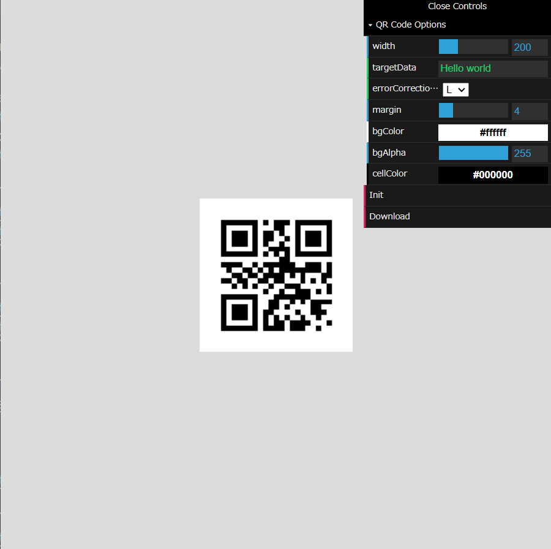

# tetunori Charts📈📊
Version 0.7.0  

# Description
Google charts query compatibility service. (Currently, "QR code" service only)

# Usage
## Query mode
⭐

## Edit mode
⭐

# Syntax📖
| Parameter | Required or Optional | Description |
| --- | --- | --- |
| `cht=qr` | Required | Chart type. Currently, support only `qr` a QR code. |
| `chs=<width>x<height>` | Required | Image size. Currently, support only square shape so that height will be ignored. |
| `chl=<data>` | Required | The data to encode. Data can be digits (0-9), alphanumeric characters, binary bytes of data, or Kanji. You cannot mix data types within a QR code. The data must be UTF-8 URL-encoded. |
| `choe` | Unsupported | Unsupported in this service. |
| `chld=<error_correction_level>\|<margin>` | Optional | 1. error_correction_level: QR codes support four levels of error correction to enable recovery of missing, misread, or obscured data. Greater redundancy is achieved at the cost of being able to store less data.  - `L`: [Default] Allows recovery of up to 7% data loss  - `M`: Allows recovery of up to 15% data loss  - `Q`: Allows recovery of up to 25% data loss  - `H`: Allows recovery of up to 30% data loss    2. margin: The width of the white border around the data portion of the code. This is in rows, not in pixels. (See below to learn what rows are in a QR code.) The default value is `4`.|

# License⚖️
Copyright (c) 2024 [Tetsunori Nakayama](https://github.com/tetunori). MIT License.

# Author
Tetsunori Nakayama

# References
## Google Charts QR Codes
[Google Charts QR Codes](https://developers.google.com/chart/infographics/docs/qr_codes) (Now depricated...)

## p5.js
[p5.js](https://github.com/processing/p5.js) by [Processing Foundation](https://github.com/processing). GNU Lesser General Public License v2.1.

## dat.GUI
[dat.GUI](https://github.com/dataarts/dat.gui) by [Google Data Arts Team](https://github.com/dataarts). Apache-2.0 license.

## node-qrcode
[node-qrcode](https://github.com/soldair/node-qrcode) by [Ryan Day(soldair)](https://github.com/soldair). MIT License.
